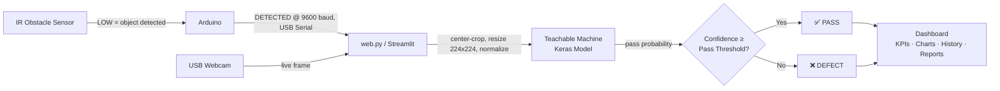
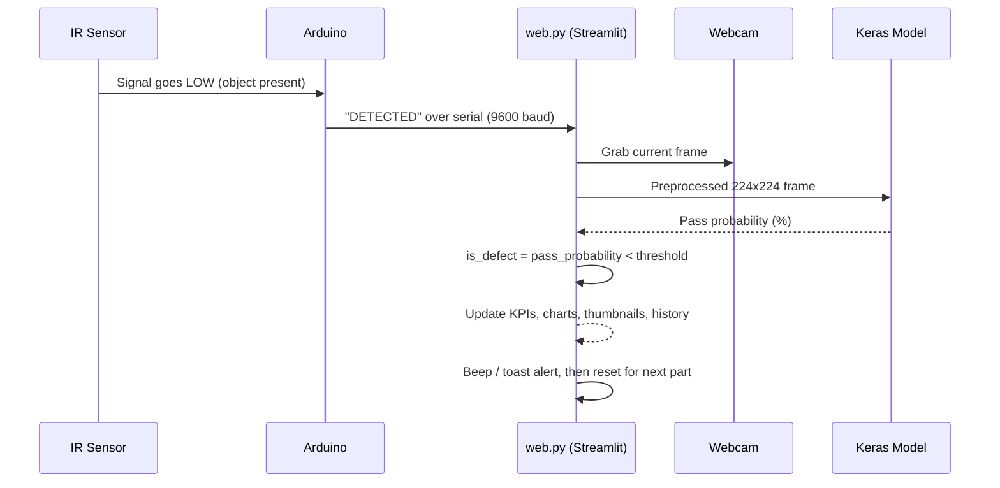

# 🛡️ AOI Vision — Smart Automated Optical Inspection

**AOI Vision** is a compact, real-time quality-control line: a part triggers an infrared sensor, a webcam captures it, an AI model classifies it as **PASS** or **DEFECT**, and the result streams live to a full analytics dashboard — KPIs, charts, history, thumbnails and exportable reports.

Built with an **Arduino** (sensor trigger), a **Teachable Machine** vision model (Keras/TensorFlow), and a **Streamlit** dashboard.


---

## 📑 Table of Contents

- [Overview](#-overview)
- [Architecture](#-architecture)
- [Features](#-features)
- [Tech Stack](#-tech-stack)
- [Project Structure](#-project-structure)
- [Quick Start](#-quick-start)
- [Detailed Setup](#-detailed-setup)
  - [1. Hardware Wiring](#1-hardware-wiring)
  - [2. Python Environment](#2-python-environment)
  - [3. Training the Vision Model](#3-training-the-vision-model)
  - [4. Running the Dashboard](#4-running-the-dashboard)
- [Configuration](#-configuration)
- [Decision Logic](#-decision-logic)
- [Code Map (`web.py`)](#-code-map-webpy)
- [Troubleshooting](#-troubleshooting)
- [Limitations](#-limitations)
- [Roadmap](#-roadmap)
- [Acknowledgments](#-acknowledgments)
- [License](#-license)

---

## 🔎 Overview

Automated Optical Inspection (AOI) systems are used on production lines to catch defective parts without a human inspector staring at every unit. This project reproduces that idea at small scale, using hobby-grade hardware and a no-code-trained vision model, while still delivering a production-style dashboard.

**Pipeline in one sentence:** *sensor → trigger → snapshot → AI classification → live dashboard.*

## 🧭 Architecture



**Sequence of one inspection cycle:**



## ✨ Features

| Category | Details |
|---|---|
| **Live view** | Webcam stream with an animated laser scan-line overlay and FPS counter |
| **AI inspection** | PASS / DEFECT decision with confidence % drawn directly on the captured frame |
| **Tunable logic** | Adjustable **Pass Threshold** and **Yield Target** sliders in the sidebar |
| **KPIs** | Total inspected, passed, defects, yield rate, inspection rate, model confidence |
| **Charts** | Yield trend, defect distribution (donut), production per minute, yield gauge |
| **History** | Thumbnails of recent parts, scrolling inspection log, last analyzed frame |
| **System health** | Live status panel for camera, Arduino, vision engine, laser scanner, production line |
| **Alerts** | Low-yield banner, audible beeps (pass/fail tones), pop-up toasts |
| **Safety** | One-click Emergency Stop that halts the line |
| **Localization** | English / Chinese interface toggle |
| **Exports** | CSV (all / passed / failed), HTML reports (charts-only or full), ZIP of rejected frames |
| **Plug-and-play** | Auto-detects the working webcam and the Arduino COM port |

## 🧰 Tech Stack

### Hardware

| Item | Role |
|---|---|
| Arduino board (USB) | Reads the IR sensor and sends `DETECTED` to the PC |
| IR obstacle sensor (digital, pin 2) | Detects a part; output goes **LOW** when triggered |
| USB webcam | Captures the image of each inspected part |
| PC (Windows) | Runs the dashboard and the AI model |

### Software

| Tool | Role |
|---|---|
| Python 3.11 | Runtime |
| Arduino IDE | Uploads the sketch to the board |
| Google Teachable Machine | No-code training of the `pass` / `defect` image classifier |
| TensorFlow 2.15 (Keras) | Loads `keras_model.h5` and runs predictions |
| Streamlit | Real-time web dashboard |
| OpenCV | Camera capture, image processing, overlay drawing |
| NumPy | Image arrays / model input tensors |
| Pandas | Tabular data for CSV exports |
| Plotly | Interactive charts (dashboard + HTML reports) |
| PySerial | Serial communication with the Arduino |

> `tf_keras` is optional — `web.py` uses it if installed, otherwise falls back to the Keras bundled with TensorFlow. Don't install a `tf_keras` version that mismatches your TensorFlow version; it will try to upgrade TensorFlow.

## 📂 Project Structure

```
AOI-Vision-Smart-Automated-Optical-Inspection/
├── arduino_ir_sensor/
│   └── arduino_ir_sensor.ino   Arduino sketch (IR sensor → serial trigger)
├── web.py                       Streamlit application (camera, AI, dashboard)
├── keras_model.h5                Vision model exported from Teachable Machine
├── labels.txt                     Class names: "0 pass" / "1 defect"
├── .gitignore
├── README.md
└── .venv/                          Python virtual environment (not committed)
```

`keras_model.h5` and `labels.txt` must sit next to `web.py`.

> 💡 The heavy `tensorflow_intel-*.whl` wheel and the `.venv/` folder should **not** be committed to Git — list them in `.gitignore` and install them locally instead (see [Quick Start](#-quick-start)).

## ⚡ Quick Start

For anyone who just wants it running:

```bash
# 1. Clone and enter the project
git clone https://github.com/<your-username>/AOI-Vision-Smart-Automated-Optical-Inspection.git
cd AOI-Vision-Smart-Automated-Optical-Inspection

# 2. Create the virtual environment and install dependencies
python -m venv .venv
.venv\Scripts\activate
pip install tensorflow==2.15.0 streamlit opencv-python pandas plotly pyserial

# 3. Upload arduino_ir_sensor/arduino_ir_sensor.ino to your Arduino (via Arduino IDE)

# 4. Launch the dashboard
streamlit run web.py
```

Then open `http://localhost:8501` in your browser. For wiring, model training and troubleshooting, see below.

## 🔧 Detailed Setup

### 1. Hardware Wiring

1. Connect the IR sensor: `VCC → 5V`, `GND → GND`, `OUT → Digital Pin 2`.
2. Open `arduino_ir_sensor/arduino_ir_sensor.ino` in the Arduino IDE and upload it.
3. **Close the Arduino IDE Serial Monitor** afterwards — only one program can hold the serial port at a time.

The sketch watches pin 2 and, on a HIGH → LOW transition (a new object breaking the beam), prints `DETECTED` at 9600 baud, then waits 500 ms to debounce.

### 2. Python Environment

```bash
python -m venv .venv
.venv\Scripts\activate

python -m pip install tensorflow==2.15.0
python -m pip install streamlit opencv-python pandas plotly pyserial
```

TensorFlow 2.15 expects NumPy 1.x (`numpy<2`). If pip flags a NumPy/OpenCV conflict, install an older `opencv-python` release.

Sanity check — an empty list means nothing is missing:

```bash
python -c "import importlib.util as u; print([m for m in ['streamlit','cv2','numpy','pandas','plotly','serial','tensorflow'] if not u.find_spec(m)])"
```

### 3. Training the Vision Model

1. On [Teachable Machine](https://teachablemachine.withgoogle.com/), create an **Image Project** with two classes: `pass` and `defect`.
2. **`pass`** — 100+ images of good parts, in varied positions, captured with the *final* camera, angle and lighting you'll use in production.
3. **`defect`** — defective parts, **plus anything that isn't a good part**: empty belt, a hand, unrelated objects. Teachable Machine has no "unknown" class, so this is how anything unexpected gets classified as a defect.
4. Train the model, then **Export Model → TensorFlow → Keras**.
5. Place `keras_model.h5` and `labels.txt` next to `web.py`. `labels.txt` must contain the lines `0 pass` and `1 defect`.

### 4. Running the Dashboard

```bash
streamlit run web.py
```

Open the URL shown in the terminal (typically `http://localhost:8501`). The sidebar reports:

- **Camera index** — which webcam is in use
- **Arduino port** — which COM port is in use
- **Sensor** — the last serial message received (should show `DETECTED` when a part or your hand breaks the beam)

## ⚙️ Configuration

At the top of `web.py`:

```python
CAMERA_INDEX = None       # None = auto-detect first working camera, or force 0, 1, 2 ...
CAMERA_BACKEND = "DSHOW"  # "DSHOW" | "MSMF" | "ANY"
ARDUINO_PORT = None       # None = auto-detect, or force "COM3", "COM5" ...
```

In-app sidebar controls:

| Control | Effect |
|---|---|
| **Pass Threshold (%)** | A part is a PASS only if the model's pass-probability exceeds this value (default `80`). Raise it to be stricter |
| **Yield Target (%)** | Triggers a low-yield alert banner when yield drops below this value (default `95`) |
| **Sound Alerts** | Toggles the pass/fail audible beeps |
| **Emergency Stop** | Immediately halts the inspection loop |
| **Reset Data** | Clears all counters and history for the current session |

The camera runs at `640×480`; the model input size (typically `224×224`) is read automatically from the loaded model.

## 🧠 Decision Logic

```python
p_prob = probability of the "pass" class (%)
is_defect = p_prob < pass_threshold   # PASS only if the model is confident it's a pass
```

This "confident-pass" rule is deliberate: anything the model isn't sure about defaults to a **DEFECT**, which is the safer failure mode for a QC line.

## 🗺️ Code Map (`web.py`)

| # | Section | Content |
|---|---|---|
| 1 | Page config + CSS | Streamlit page settings and the dark theme |
| 2 | Translation | `LANG` dictionary (English / Chinese strings) |
| 3 | Session state | Counters, history, recent parts, failed frames (`S`) |
| 4 | Sidebar | Language toggle, emergency stop, sliders, reset, health panel |
| 5 | Header + emergency stop | Title, status chips, halt screen |
| 6 | Layout | Columns, containers and placeholders refreshed by the loop |
| 7 | Helpers | Image encoding, `stats()`, chart builders, HTML report, CSV, ZIP |
| 8 | Render functions | Live header, status banner, thumbnails, KPI cards, charts |
| 9 | Hardware + AI init | `find_arduino_port()`, `open_camera()`, `load_ai()`, `preprocess()`, `inspect_image()` |
| 10 | Continuous loop | Read frame → show live video → wait for `DETECTED` → classify → record → refresh |

## 🩺 Troubleshooting

| Problem | Fix |
|---|---|
| "Camera not found" / wrong camera used | Set `CAMERA_INDEX` explicitly. Indexes can shift after a reboot. Close any app/tab using the webcam. Check **Windows Settings → Privacy & security → Camera**. Try `CAMERA_BACKEND = "MSMF"` |
| Want the webcam as the primary camera | Disable the built-in laptop camera in **Device Manager → Cameras** |
| "Arduino disconnected" | Check the USB cable, close the Arduino IDE Serial Monitor, verify the COM port in **Device Manager → Ports**, or set `ARDUINO_PORT` |
| Nothing happens on trigger | Watch the **Sensor** line in the sidebar. If `DETECTED` never appears, check the wiring, the sensor's sensitivity screw, and that the sketch is actually uploaded |
| Everything classifies as PASS | The `defect` class needs more variety: empty belt, hand, foreign objects. Retrain, re-export, and raise the Pass Threshold |
| Too many good parts rejected | Lower the Pass Threshold, or add more `pass` images from the final setup |
| Model fails to load | Confirm `keras_model.h5` and `labels.txt` sit next to `web.py`, and that TensorFlow 2.15 is installed. Avoid a mismatched `tf_keras` |
| pip suddenly downloads a new TensorFlow | Press `Ctrl+C` — a mismatched `tf_keras` release is trying to upgrade it |
| First launch is slow | TensorFlow + the model take 30–60s to load after a reboot; subsequent runs are faster |
| Charts missing from an exported HTML report | The report loads Plotly from the internet — open it while online |

## ⚠️ Limitations

- **Windows-only**: `winsound`, the DirectShow camera backend, and COM ports are Windows-specific.
- Results live in memory for the current session only — export reports before closing the tab.
- The dashboard retains the last **100** rejected frames.
- Classification quality depends on using the **same camera, position and lighting** for both training and production images.

## 🛣️ Roadmap

- [ ] Cross-platform camera/serial backend (Linux/macOS support)
- [ ] Persistent storage (SQLite) for session history
- [ ] Multi-camera / multi-station support
- [ ] REST API for external MES/SCADA integration

## 🙏 Acknowledgments

- [Google Teachable Machine](https://teachablemachine.withgoogle.com/) for the no-code model training workflow.
- [Streamlit](https://streamlit.io/) for making a real-time industrial-style dashboard achievable in a single script.

## 📄 License

This project is licensed under the [MIT License](LICENSE).

---

<p align="center">Built as a hands-on exploration of low-cost AOI: sensor → camera → AI → dashboard, end to end.</p>